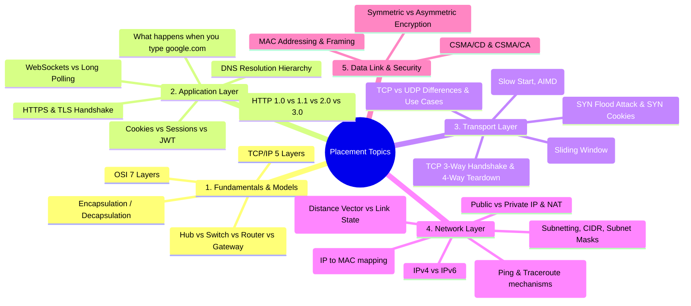

# 🌐 Computer Networks: Placement & Fundamentals Handbook

> A crisp, concept-first study guide designed for understanding **Computer Networks** from scratch and cracking technical interviews (SDE, Backend, Systems, DevOps, Cloud).

---

## 🎯 Why This Guide? (Placement Context)

In technical interviews, Computer Networks is one of the foundational core CS subjects (alongside OS, DBMS, and DSA). Interviewers look for:
1. **Clear Mental Models**: Do you understand what actually happens under the hood when data leaves your machine?
2. **Protocol Trade-offs**: Can you explain *why* a protocol was chosen (e.g., TCP vs. UDP, HTTP/2 vs. HTTP/3)?
3. **Core Scenarios**: Can you walk step-by-step through standard scenarios like *"What happens when you type `google.com` in your browser?"*
4. **Calculations**: Can you calculate subnet masks, usable host ranges, and transmission vs. propagation delays?

---

## 🧠 High-Frequency Interview Blueprint (Must-Know Topics)

Interviewers across Tier-1 tech companies, startups, and service companies repeatedly test these core areas:

---

## 💡 Top 5 High-Yield Interview Questions

### 1. What happens when you type `https://www.google.com` and press Enter?
This classic question tests your end-to-end understanding across every layer:
1. **URL Parsing & Browser Cache**: Browser parses the protocol, domain, port, and checks browser/OS DNS cache.
2. **DNS Resolution**: If not cached, queries Resolver $\to$ Root $\to$ TLD (`.com`) $\to$ Authoritative DNS server to resolve IP.
3. **ARP Request**: If the router/gateway MAC address is unknown, sends an ARP broadcast to get the gateway's MAC address.
4. **TCP 3-Way Handshake**: Client sends `SYN`, server responds with `SYN-ACK`, client returns `ACK`.
5. **TLS Handshake (HTTPS)**: Asymmetric cryptography negotiates cipher suites and exchanges symmetric session keys.
6. **HTTP Request/Response**: Browser sends `GET / HTTP/1.1` or HTTP/2 frame; server responds with HTML/CSS/JS.
7. **Rendering**: Browser parses HTML, builds DOM/CSSOM, and renders pixels on the screen.

### 2. TCP vs. UDP — When do you pick which?
- **TCP (Transmission Control Protocol)**: Connection-oriented, guarantees delivery, in-order, flow control, congestion control. Used for: Web (HTTP/HTTPS), Email (SMTP), File transfer (FTP/SFTP), Remote login (SSH).
- **UDP (User Datagram Protocol)**: Connectionless, lightweight, best-effort (no delivery guarantee, no order, no retransmission). Used for: Live video streaming, VoIP (Zoom, Discord), DNS queries, Online gaming, QUIC/HTTP/3.

### 3. What is the difference between a Hub, Switch, and Router?
- **Hub (Physical Layer - L1)**: Dumb repeater. Broadcasts incoming bits to **all** ports. High collision rate, no intelligence.
- **Switch (Data Link Layer - L2)**: Learns MAC addresses into a CAM table. Forwards frames directly to the specific destination port (unicast).
- **Router (Network Layer - L3)**: Connects different logical networks (e.g., your home LAN to the global Internet). Routes packets based on IP addresses using routing tables.

### 4. How does Subnetting & CIDR work?
- CIDR notation: `192.168.1.0/24` means the first 24 bits are the **Network ID**, and the remaining $32 - 24 = 8$ bits are for **Host IDs**.
- Total IP addresses: $2^8 = 256$.
- Usable host IPs: $2^8 - 2 = 254$ (subtracting Network Address and Broadcast Address).

### 5. What is NAT (Network Address Translation)?
- Allows multiple private IP devices in a local home/office network (e.g., `192.168.x.x`) to share a single public IPv4 address assigned by your ISP.
- Uses **PAT (Port Address Translation)** to map internal IP:Port pairs to external Public IP:Port pairs.

---

## ⚡ Rapid Concept Check Cheat Sheet

| Concept | Layer | Core Role | Key Protocol / Standard |
| :--- | :--- | :--- | :--- |
| **Port Numbers** | Transport (L4) | Identifies process/application on a machine | HTTP (80), HTTPS (443), DNS (53), SSH (22) |
| **IP Address** | Network (L3) | Logical, routable address across networks | IPv4 (32-bit), IPv6 (128-bit) |
| **MAC Address** | Data Link (L2) | Physical, permanent hardware address on local link | 48-bit hex (e.g., `00:1A:2B:3C:4D:5E`) |
| **ARP** | Data Link / Network | Resolves known IP address to physical MAC address | ARP Request (Broadcast), ARP Reply (Unicast) |
| **ICMP** | Network (L3) | Diagnostic error reporting & network queries | `ping` (Echo Request/Reply), `traceroute` (TTL expired) |
| **DNS** | Application (L7) | Translates human names to IP addresses | Uses UDP port 53 (TCP for zone transfers/large payloads) |
| **TCP Handshake** | Transport (L4) | Establishes reliable state before data transfer | `SYN` $\to$ `SYN-ACK` $\to$ `ACK` |
| **TCP Teardown** | Transport (L4) | Gracefully terminates bidirectional connection | `FIN` $\to$ `ACK` $\to$ `FIN` $\to$ `ACK` |

---

## 📖 Recommended Study Path

1. **[intro.md](./intro.md)**: Start here! Understand prerequisites, basic definitions (What is the Internet? Internet vs. Web), and how packets travel.
2. **Network Models**: Master OSI 7-layer vs. TCP/IP 5-layer and packet encapsulation.
3. **Application Protocols**: Focus heavily on DNS, HTTP (1.1 vs 2 vs 3), and HTTPS/TLS.
4. **Transport Protocols**: Master TCP 3-way handshake, state transitions, flow control, and UDP differences.
5. **Network Layer & Addressing**: Practice CIDR math, subnet calculations, NAT, and ARP.
6. **Interview Rehearsal**: Practice verbally answering the top questions out loud.

---

## 📚 Standard References

- *Computer Networking: A Top-Down Approach* — Kurose & Ross
- *Computer Networks* — Andrew S. Tanenbaum
- RFC standards for protocol specifications ([IETF Datatracker](https://datatracker.ietf.org/))
