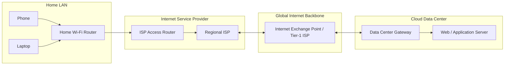
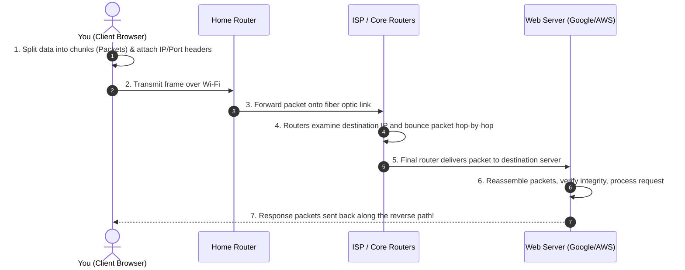

# 🌐 Introduction to Computer Networks & The Internet

> A beginner-friendly, concept-first introduction covering foundational definitions, prerequisites, the architecture of the Internet, and key interview distinctions.

---

## 📌 Table of Contents

1. [Prerequisites: What You Need to Know First](#1-prerequisites-what-you-need-to-know-first)
2. [Fundamental Definitions: From First Principles](#2-fundamental-definitions-from-first-principles)
   - [What is a Network?](#what-is-a-network)
   - [What is a Node & a Link?](#what-is-a-node--a-link)
   - [What is a Protocol?](#what-is-a-protocol)
   - [What is the Internet?](#what-is-the-internet)
3. [Crucial Distinctions (Interview Favorites)](#3-crucial-distinctions-interview-favorites)
   - [Internet vs. World Wide Web (WWW)](#internet-vs-world-wide-web-www)
   - [Internet vs. Intranet vs. Extranet](#internet-vs-intranet-vs-extranet)
4. [How Does the Internet Work? (The High-Level Mental Model)](#4-how-does-the-internet-work-the-high-level-mental-model)
   - [The Postal Service Analogy](#the-postal-service-analogy)
   - [The Journey of Data Across the Globe](#the-journey-of-data-across-the-globe)
   - [Why Packet Switching? (Why not Circuit Switching?)](#why-packet-switching-why-not-circuit-switching)
5. [Essential Performance Metrics](#5-essential-performance-metrics)
   - [Bandwidth vs. Throughput vs. Latency](#bandwidth-vs-throughput-vs-latency)
   - [Transmission Delay vs. Propagation Delay](#transmission-delay-vs-propagation-delay)
   - [Round Trip Time (RTT), Jitter & Packet Loss](#round-trip-time-rtt-jitter--packet-loss)
6. [Why Do Networks Use Layers? (The Core Abstraction)](#6-why-do-networks-use-layers-the-core-abstraction)
   - [The 5-Layer Stack in Plain English](#the-5-layer-stack-in-plain-english)
7. [Placement Quick-Revision Checklist](#7-placement-quick-revision-checklist)

---

## 1. Prerequisites: What You Need to Know First

You **do not** need advanced mathematics or electronics knowledge to understand computer networks. However, having clarity on these basic computing concepts will make learning smooth:

### 1. Basic OS & Process Concepts
- **Client vs. Server**: A *client* initiates requests (e.g., your browser); a *server* waits for and responds to incoming requests (e.g., Google's web server).
- **Process & Port**: An operating system runs multiple programs simultaneously as *processes*. A **Port Number** (e.g., `80`, `443`) is simply an identifier allowing the OS to deliver incoming data to the correct specific process.

### 2. Units of Measurement & Number Systems
- **Bits vs. Bytes**:
  - $1 \text{ Byte} = 8 \text{ bits}$.
  - Network speeds are quoted in **bits per second** ($\text{bps}$, $\text{Mbps}$, $\text{Gbps}$ with lowercase `b`).
  - File sizes and memory storage are quoted in **Bytes** ($\text{KB}$, $\text{MB}$, $\text{GB}$ with uppercase `B`).
  - *Example*: A $100 \text{ Mbps}$ internet connection downloads a file at a theoretical maximum of $\frac{100}{8} = 12.5 \text{ MB/s}$.
- **Powers of 10 vs. Powers of 2**:
  - In networking bandwidth: $1 \text{ kbps} = 10^3 \text{ bps} = 1,000 \text{ bps}$ (decimal).
  - In storage/memory: $1 \text{ KiB} = 2^{10} \text{ Bytes} = 1,024 \text{ Bytes}$ (binary).
- **Hexadecimal Notation**: MAC addresses and IPv6 addresses use base-16 (`0-9` and `A-F`).

---

## 2. Fundamental Definitions: From First Principles

### What is a Network?
A **computer network** is any collection of autonomous computing devices connected together by communication links so they can share resources, exchange data, and communicate.

### What is a Node & a Link?
- **Node**: Any active device connected to the network that can send, receive, or forward data.
  - *End Systems (Hosts)*: Computers, phones, servers, IoT devices.
  - *Intermediary Devices*: Switches, routers, firewalls, cell towers.
- **Link**: The physical or wireless medium through which signals travel from one node to another:
  - *Wired Links*: Twisted-pair copper (Ethernet Cat6), coaxial cable, optical fiber.
  - *Wireless Links*: Wi-Fi (radio waves), Cellular (4G/5G), Satellite microwave.

### What is a Protocol?
When two humans speak, they follow unwritten rules (language, taking turns, greeting each other). Computers lack human intuition, so they require strict, unambiguous rules called **protocols**.

> **Definition**: A **protocol** defines the **format (syntax)**, the **meaning (semantics)**, and the **order/timing** of messages exchanged between two or more communicating entities, as well as the actions taken when messages arrive or timeouts occur.

*Every protocol answers three questions*:
1. **Syntax**: What does the packet look like? (Field positions, bit lengths).
2. **Semantics**: What does each field mean? (e.g., if a bit is `1`, does it mean "acknowledge"?).
3. **Timing**: How fast can data be sent, and who talks first?

---

### What is the Internet?
The **Internet** (short for *inter-network*) is a **global network of networks**.

- It is not owned or governed by a single company or government.
- It connects millions of private, public, academic, business, and government networks.
- They are all glued together by a shared, standardized suite of open communication protocols: the **TCP/IP protocol suite**.
- **Historical origin**: Started as **ARPANET** in 1969 (funded by the US Department of Defense), which initially connected four university computers. It transitioned to the standard TCP/IP architecture on January 1, 1983.



---

## 3. Crucial Distinctions (Interview Favorites)

### Internet vs. World Wide Web (WWW)
These two terms are used interchangeably in casual conversation, but in technical interviews, confusing them is a major red flag:

```
+------------------------------------------------------------------------+
|                          THE INTERNET                                  |
|         (Global Physical & Logical Network Infrastructure)             |
+------------------------------------------------------------------------+
   |             |               |              |              |
   v             v               v              v              v
+---------+ +---------+    +-----------+  +------------+ +---------------+
| World   | |  Email  |    | File Xfer |  | Streaming  | | Remote Shell  |
| Wide    | | (SMTP,  |    |  (FTP,    |  |  (VoIP,    | |    (SSH)      |
| Web     | |  IMAP)  |    | BitTorrent|  |  Zoom, OTT)| |               |
| (HTTP/  | +---------+    +-----------+  +------------+ +---------------+
|  HTTPS) |
+---------+
```

| Dimension | The Internet | The World Wide Web (WWW) |
| :--- | :--- | :--- |
| **What is it?** | The underlying **infrastructure** (cables, routers, packets, IP addressing). | A software **service / application** running *on top* of the Internet. |
| **What does it contain?** | Hardware, links, routing protocols (TCP, IP, BGP). | Linked web pages, documents, images, and videos. |
| **Primary Protocols** | IP, TCP, UDP, BGP, OSPF. | HTTP, HTTPS, WebSockets. |
| **Invented By** | DARPA / Vint Cerf & Bob Kahn (1970s–1980s). | Tim Berners-Lee at CERN (1989). |
| **Analogy** | The highway and road network. | The delivery trucks, postal vans, and cars driving on that road. |

---

### Internet vs. Intranet vs. Extranet

```
[       INTERNET: Open to the entire world        ]
        |
        +---> [ EXTRANET: Accessible to trusted partners / vendors ]
              |
              +---> [ INTRANET: Strictly private to internal employees ]
```

1. **Internet**: Publicly accessible to anyone with a connection. Globally unconstrained.
2. **Intranet**: A strictly private network restricted to authorized members of an organization (e.g., a university portal or company internal wiki). It is shielded from the public internet using firewalls and VPNs.
3. **Extranet**: A private intranet that securely opens controlled access to trusted external parties (e.g., suppliers, vendors, or partner companies).

---

## 4. How Does the Internet Work? (The High-Level Mental Model)

### The Postal Service Analogy

The easiest way to build intuition about networking is comparing it to sending a physical letter:

| Postal Service Component | Computer Networking Equivalent |
| :--- | :--- |
| Writing a letter on paper | Application message (e.g., `GET /index.html`) |
| Putting the letter into an envelope | **Encapsulation** (adding headers) |
| Recipient's Apartment Number / Name | **Port Number** (identifies the specific app/process) |
| Recipient's Street Address & Postal Code | **IP Address** (identifies the exact host in the world) |
| Dropping the letter in the local postbox | Sending bits to your local home Wi-Fi router |
| Local post office sorting truck | Local ISP access router |
| Regional distribution hubs & cargo airplanes | Tier-1 Core Internet Routers & undersea fiber cables |
| Mail carrier delivering to the mailbox | Data Link layer delivery (Ethernet / Wi-Fi frame) |

---

### The Journey of Data Across the Globe

When you request a page or submit a form:



---

### Why Packet Switching? (Why not Circuit Switching?)

The single most fundamental architectural decision of the Internet is **Packet Switching**.

In the old telephone network (**Circuit Switching**):
- When you make a call, a dedicated physical circuit/wire path is reserved exclusively for you from start to finish.
- If you stop speaking for 30 seconds, that capacity sits completely idle and wasted. No one else can use it.

In the Internet (**Packet Switching**):
- Data is chopped up into small units called **packets**.
- Each packet contains header information (source IP, destination IP, sequence number).
- Packets share links **on demand** (called **Statistical Multiplexing**).
- Different packets from different users travel down the same wire simultaneously, interweaving with one another.

> **Why does this matter?**
> Computer data is **bursty** (you click a link, download data for 200 ms, then read the screen for 2 minutes). Circuit switching would leave lines 99% idle. Packet switching lets hundreds of users share the same wire without wasting bandwidth!

---

## 5. Essential Performance Metrics

When analyzing or debugging network performance, interviewers test your understanding of three key concepts:

### Bandwidth vs. Throughput vs. Latency
- **Bandwidth**: The theoretical maximum data-carrying capacity of a link (e.g., *"My home connection is 1 Gbps"*).
- **Throughput**: The *actual* rate at which useful data is successfully transferred across the link at any given moment (e.g., *"Due to congestion, I am getting 45 Mbps"*).
- **Latency (Delay)**: The time it takes for a piece of data to travel from the source to the destination (measured in milliseconds).

> **Water Pipe Analogy**:
> - **Bandwidth** = Width / diameter of the pipe.
> - **Throughput** = The actual volume of water flowing through the pipe right now.
> - **Latency** = The time it takes for a drop of water to travel from the tap to the bucket.

---

### Transmission Delay vs. Propagation Delay
> ⚠️ **The #1 Most Tested Math Concept in Campus Placements!**

```
Source Host                       Intermediate Wire / Fiber                       Destination
+------------+                                                                    +------------+
|  [Packet]  | ===[Push bits onto wire]===>  ~~~~~~~~~~~~~~~~~~ ===[Light Speed]==> |  Receive   |
+------------+        Transmission Delay                 Propagation Delay        +------------+
```

1. **Transmission Delay ($d_{\text{trans}}$)**:
   - The time required to push (pump) all the bits of a packet onto the physical wire.
   - Depends **only** on packet size ($L$) and link speed ($R$):
     $$\Large d_{\text{trans}} = \frac{L}{R} = \frac{\text{Packet size in bits}}{\text{Bandwidth in bps}}$$

2. **Propagation Delay ($d_{\text{prop}}$)**:
   - The time it takes for one bit to physically travel down the wire from sender to receiver at the speed of light in the medium ($\approx 2 \times 10^8 \text{ m/s}$).
   - Depends **only** on distance ($d$) and propagation speed ($s$):
     $$\Large d_{\text{prop}} = \frac{d}{s} = \frac{\text{Distance in meters}}{\text{Speed in m/s}}$$

#### Example Numerical:
*A sender transmits a 1,000-byte packet over a 10 Mbps link across a distance of 2,000 km (speed of light in cable = $2 \times 10^8 \text{ m/s}$). Calculate both delays.*

1. **Transmission Delay**:
   - $L = 1000 \text{ Bytes} \times 8 = 8,000 \text{ bits}$
   - $R = 10 \text{ Mbps} = 10 \times 10^6 \text{ bps}$
   - $d_{\text{trans}} = \frac{8000}{10 \times 10^6} = 0.0008 \text{ s} = \mathbf{0.8 \text{ ms}}$

2. **Propagation Delay**:
   - $d = 2000 \text{ km} = 2 \times 10^6 \text{ meters}$
   - $s = 2 \times 10^8 \text{ m/s}$
   - $d_{\text{prop}} = \frac{2 \times 10^6}{2 \times 10^8} = 0.01 \text{ s} = \mathbf{10 \text{ ms}}$

---

### Round Trip Time (RTT), Jitter & Packet Loss
- **RTT (Round Trip Time)**: The time it takes for a small packet to travel from client to server and back again.
- **Jitter**: The variation or inconsistency in packet arrival latency (critical for voice calls and video games).
- **Packet Loss**: When a router's queue/buffer is completely full due to congestion, incoming packets are dropped.

---

## 6. Why Do Networks Use Layers? (The Core Abstraction)

Imagine building a web browser where you, as the programmer, had to write code to:
1. Render HTML and CSS,
2. Manage user sessions,
3. Monitor packet retransmissions,
4. Calculate electrical voltages over the copper pins of the Ethernet jack.

Writing software would be impossible! 

Computer networks solve this through **Layering (Separation of Concerns)**:
- Each layer solves **one specific problem**.
- Each layer provides a clean service to the layer above it.
- Each layer is isolated: You can upgrade Wi-Fi to 5G without changing a single line of your web application code!

### The 5-Layer Stack in Plain English

```
+-------------------------------------------------------------------------------+
| 5. Application Layer  | What do the apps want to say? (HTTP, DNS, SSH)        |
+-----------------------+-------------------------------------------------------+
| 4. Transport Layer    | Which app process on the machine gets it? (TCP, UDP)  |
+-----------------------+-------------------------------------------------------+
| 3. Network Layer      | How do we route it across the global world? (IP)      |
+-----------------------+-------------------------------------------------------+
| 2. Data Link Layer    | How do we hop across this one physical cable/Wi-Fi?   |
+-----------------------+-------------------------------------------------------+
| 1. Physical Layer     | How do we turn bits into physical signals/light?     |
+-------------------------------------------------------------------------------+
```

---

## 7. Placement Quick-Revision Checklist

Before moving forward, check if you can answer these standard interview questions:

- [ ] **What is the difference between the Internet and the World Wide Web?** *(Internet is the global hardware network; WWW is an application running on HTTP).*
- [ ] **Why does the Internet use packet switching instead of circuit switching?** *(Statistical multiplexing handles bursty computer data efficiently).*
- [ ] **Can you calculate transmission delay vs. propagation delay?** *($d_{\text{trans}} = L/R$ vs. $d_{\text{prop}} = d/s$).*
- [ ] **What is a port number vs. an IP address?** *(IP address identifies the machine on the network; Port number identifies the specific application process running inside that machine).*
- [ ] **Why are networks divided into layers?** *(Modularity, abstraction, and independent protocol evolution).*

---

### ⏭️ Next Recommended Topic
With these fundamentals set, explore the **Layered Models (OSI 7-Layer vs. TCP/IP 5-Layer)** and understand how **Encapsulation & Decapsulation** wrap headers onto your data.
